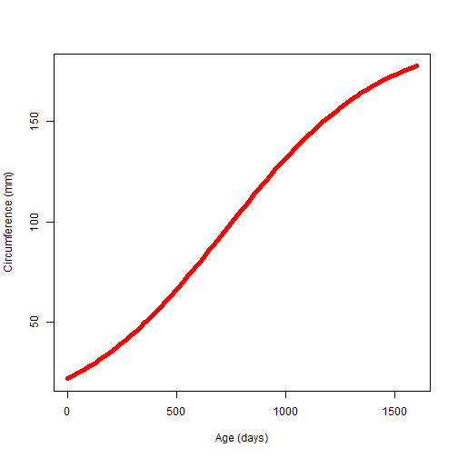

## Introduction

### When you observe a tree, a frequent question coming to mind is:    
### "how old is it?"
   
    
Sure, everybody knows that a good way to answer this question is to cut down the tree and to count the number of rings .... But how to estimate the age without killing the tree??????
   
      
We know that a lot of factors influence the growth of the trees: climatic, environmental, disponibility in nutriments ... Nevertheless, we will study here a dataset about Orange trees ("Orange", in datasets package) and how their circumference evolves with time. From this relation, an application was elaborated in order to estimate the age of the trees.
    
       
Let's have a look!

--- {class: class1, bg: white, id: id1}

## Dataset

The Orange dataset contains the circumference (mm) for 7 ages (days) of 5 orange trees. Let's do a plot:   
 NULL

--- .class #id

## Regression

We can link the circumference of the tree and its age by a regression:


```r
# calcul for the mean of the circumference between the trees
x <- unique(Orange$age)
y <- numeric()
for(i in 1:7){y <- c(y, mean(Orange$circumference[Orange$age==x[i]]))}

# regression model for calcultaing the circumference, giving the age
reg <- nls(y~SSlogis(x, Asym, xmid, scal))

# regression model for calculating the age, giving the circumference
reg2 <- nls(x~SSlogis(y, Asym, xmid, scal))
```

--- .class #id

## Result of the regression

 NULL

Please, have a look to the ShinyApp: 
https://steph-d.shinyapps.io/shinyappProject
